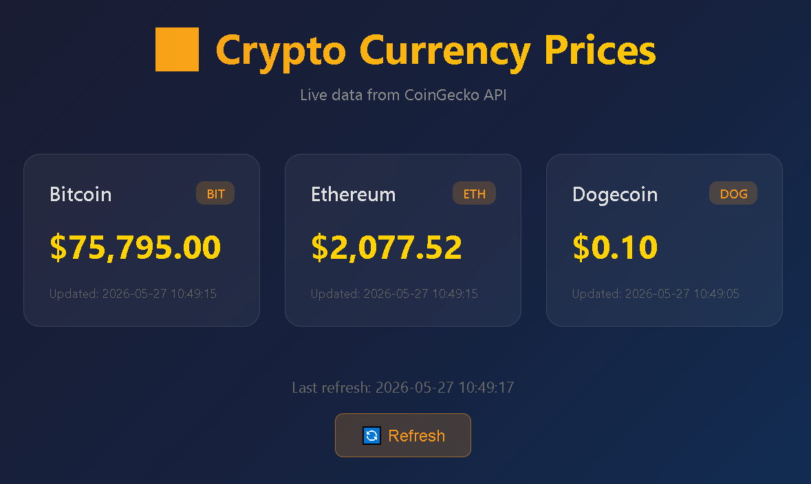

# 🪙 Crypto Price Dashboard

Веб-приложение для отображения актуальных курсов криптовалют в реальном времени. Данные запрашиваются с публичного API CoinGecko и отображаются в адаптивном веб-интерфейсе. Приложение контейнеризировано в Docker.



## 🚀 Возможности

- Получение актуальных курсов криптовалют (Bitcoin, Ethereum, Dogecoin)
- Адаптивный веб-интерфейс с поддержкой мобильных устройств
- Автоматическое обновление данных при перезагрузке страницы
- Контейнеризация Docker для простого развёртывания
- Обработка ошибок API (нет соединения, некорректный ответ)

## 🛠️ Стек технологий

- **Backend:** Python 3.11, Flask
- **Frontend:** HTML5, CSS3 (Flexbox, Grid, адаптивная вёрстка)
- **API:** CoinGecko (публичный, без ключа)
- **Контейнеризация:** Docker, Docker Compose

## 📦 Установка и запуск

### Локально (без Docker)

```bash
pip install -r requirements.txt
python -m app.main
